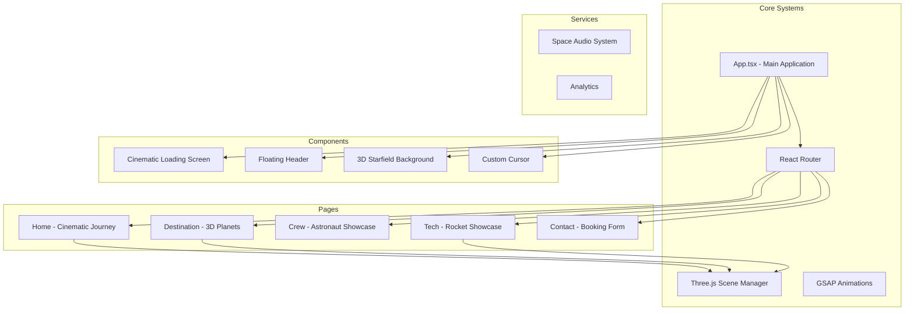

# 🪐 ASTRAL JOURNEYS - Legendary Space Tourism Website

## Project Overview

This is an ambitious, award-winning space tourism website featuring a cinematic home page journey, interactive 3D planets, crew showcase, technology demonstrations, and a premium booking experience.

## Architecture Diagram



## Implementation Plan

### Phase 1: Core Infrastructure & Cinematic Loading
**Status: In Progress**

1. **CinematicLoading Component** ✅ Already exists
   - Progress bar with loading steps
   - Fade out animation
   - Triggers main app

2. **Enhanced Loading Screen**
   - 3D preloader animation
   - Asset loading progress
   - Smooth transition to experience

3. **Space Audio System**
   - Ambient background music
   - Sound effects for interactions
   - Mute/unmute controls

### Phase 2: Cinematic Home Page Journey
**Status: Pending**

1. **SpaceJourney Component** - The centerpiece
   - Camera path system
   - Planet flybys
   - Particle effects
   - Black hole sequence

2. **Journey Sequence**
   ```
   0-5s:    Earth launch (close-up, camera pull back)
   5-10s:   Moon flyby (motion blur effect)
   10-15s:  Asteroid belt (particles whizzing by)
   15-20s:  Mars orbit (red surface details)
   20-25s:  Jupiter approach (massive storms)
   25-30s:  Saturn ring fly-through
   30-35s:  Sun approach (lens flare, heat distortion)
   35-45s:  Black hole approach (gravitational lensing)
   45-50s:  Black hole entry (time dilation effect)
   50-55s:  Emerge into starfield
   55-60s:  Company reveal + Enter button
   ```

3. **Cinematic Effects**
   - Motion blur on fast movement
   - Depth of field for cinematic feel
   - Lens flare effects
   - Gravitational lensing shader for black hole

### Phase 3: Destination Page - 3D Planet Explorer
**Status: Pending**

1. **Interactive Planet3D Component** ✅ Already exists
   - Needs enhancement with better textures
   - Atmospheric effects
   - Ring systems

2. **Planet Configurations**
   ```typescript
   const planets = [
     {
       name: 'Moon',
       color: '#c0c0c0',
       size: 1,
       rotationSpeed: 0.001,
       textureType: 'moon',
       distance: '384,400 km',
       travelTime: '3 days',
       conditions: 'Vacuum, extreme temperatures',
       highlights: ['Sea of Tranquility', 'Apollo Landing Sites'],
       bestTime: 'Any time (no atmosphere)'
     },
     {
       name: 'Mars',
       color: '#cd5c5c',
       size: 1.5,
       rotationSpeed: 0.001,
       textureType: 'mars',
       distance: '225 million km',
       travelTime: '6-9 months',
       conditions: 'Thin CO2 atmosphere, cold',
       highlights: ['Olympus Mons', 'Valles Marineris'],
       bestTime: 'Every 26 months (launch window)'
     },
     {
       name: 'Europa',
       color: '#f5f5dc',
       size: 0.8,
       rotationSpeed: 0.002,
       textureType: 'europa',
       distance: '628 million km',
       travelTime: '3 years',
       conditions: 'Ice surface, subsurface ocean',
       highlights: ['Ice Geysers', 'Subsurface Life Search'],
       bestTime: 'Optimal alignment every 13 months'
     },
     {
       name: 'Titan',
       color: '#ffa500',
       size: 1.2,
       rotationSpeed: 0.0005,
       textureType: 'titan',
       distance: '1.2 billion km',
       travelTime: '7 years',
       conditions: 'Thick nitrogen atmosphere, methane lakes',
       highlights: ['Methane Lakes', 'Dune Fields'],
       bestTime: 'Saturn opposition every 15 years'
     }
   ]
   ```

3. **UI Features**
   - Glass-morphism info cards
   - Smooth slide-in animations
   - Hover glow effects
   - Planet rotation controls

### Phase 4: Crew Page - Astronaut Showcase
**Status: Pending**

1. **Crew Member Data**
   ```typescript
   const crew = [
     {
       name: 'Douglas Hurley',
       position: 'Commander',
       bio: 'Former Marine Corps pilot, Space Shuttle commander, first person to pilot Crew Dragon.',
       image: '/assets/assets/crew/image-douglas-hurley.webp'
     },
     {
       name: 'Victor Glover',
       position: 'Pilot',
       bio: 'Navy commander, first African-American on long-duration ISS mission.',
       image: '/assets/assets/crew/image-victor-glover.webp'
     },
     {
       name: 'Mark Shuttleworth',
       position: 'Mission Specialist',
       bio: 'Space tourist, first African in space, founder of Canonical.',
       image: '/assets/assets/crew/image-mark-shuttleworth.webp'
     },
     {
       name: 'Anousheh Ansari',
       position: 'Space Tourist',
       bio: 'First female space tourist, Iranian-American engineer and entrepreneur.',
       image: '/assets/assets/crew/image-anousheh-ansari.webp'
     }
   ]
   ```

2. **UI Features**
   - Staggered card entrance animations
   - Card flip on hover
   - Zero-g particle effects
   - 3D astronaut model in background

### Phase 5: Technology Page - Rocket Showcase
**Status: Pending**

1. **Rocket Components**
   - 3D rocket model (procedural or imported)
   - Automated camera orbits
   - Animated callout labels
   - Technical specifications panel

2. **Camera Sequences**
   - Full rocket reveal
   - Fusion propulsion zoom
   - Life support module orbit
   - Cryo-sleep chamber focus
   - Navigation AI highlight
   - Heat shield detail

3. **Visual Effects**
   - Engine thrust particles
   - Holographic UI elements
   - Smooth transitions between sections

### Phase 6: Contact/Booking Page
**Status: Pending**

1. **Form Fields**
   - Name (with validation)
   - Email (with validation)
   - Destination selector (with 3D previews)
   - Departure date (space-themed picker)
   - Number of passengers

2. **Interactive Elements**
   - Mini 3D planet previews
   - Smooth form validation animations
   - Epic submit button hover effect
   - Success confirmation animation

3. **Background**
   - Floating asteroids
   - Satellite models
   - Ambient particles

### Phase 7: Polish & Performance
**Status: Pending**

1. **Visual Polish**
   - Glass-morphism UI throughout
   - Glowing accents (electric blue, aurora green)
   - Premium typography (Orbitron, Space Grotesk)
   - Subtle light leaks and gradients

2. **Performance**
   - Lazy loading for 3D scenes
   - Asset optimization
   - 60fps animation target
   - Mobile simplified versions

3. **Audio**
   - Cinematic orchestral music
   - Ambient space sounds
   - Interaction sound effects
   - Mute control accessibility

## File Structure

```
src/
├── components/
│   ├── CinematicLoading/
│   ├── CustomCursor/
│   ├── Header/
│   ├── LoadingScreen/
│   ├── MobileScene/
│   ├── Planet3D/
│   ├── SceneManager/
│   ├── Spaceship/
│   ├── Starfield/
│   ├── Starfield3D/
│   ├── SpaceJourney/          [NEW - Cinematic journey]
│   ├── BlackHole/             [NEW - Black hole effects]
│   ├── AudioPlayer/           [NEW - Space audio system]
│   └── UI/
│       ├── MagneticButton/
│       ├── ParallaxSection/
│       ├── RevealText/
│       └── StatsCounter/
├── hooks/
│   ├── useGSAPAnimation.ts
│   ├── usePerformance.ts
│   └── useSpaceAudio.ts       [NEW]
├── pages/
│   ├── Home/
│   ├── Destination/
│   ├── Crew/
│   ├── Tech/
│   └── Contact/
└── utils/
    ├── cameraPaths.ts         [NEW]
    ├── planetTextures.ts      [NEW]
    └── shaders/               [NEW]
        ├── blackHole.glsl
        ├── lensFlare.glsl
        └── nebula.glsl
```

## Key Technical Decisions

### 1. Three.js Approach
- Use procedural textures for planets (no external assets needed)
- Custom shaders for special effects (black hole, lens flare)
- Efficient particle systems for stars and asteroids
- Camera path system for cinematic movements

### 2. Animation Strategy
- GSAP for UI animations (smooth, professional)
- Three.js for 3D scene animations
- Staggered entrance animations for visual interest
- Page transitions with overlay wipes

### 3. Performance Considerations
- Reduce particle counts on mobile
- Simplify shaders for older devices
- Lazy load 3D scenes
- Use instanced rendering where possible

## Next Steps

1. ✅ Set up Three.js and GSAP (already done)
2. 🔄 Create SpaceJourney component (in progress)
3. ⏳ Enhance Planet3D with better textures
4. ⏳ Build crew page with 3D elements
5. ⏳ Create technology showcase
6. ⏳ Implement contact/booking form
7. ⏳ Add audio system
8. ⏳ Final polish and optimization

---

**Legend**: ✅ Done | 🔄 In Progress | ⏳ Pending
